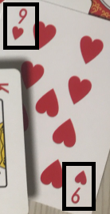
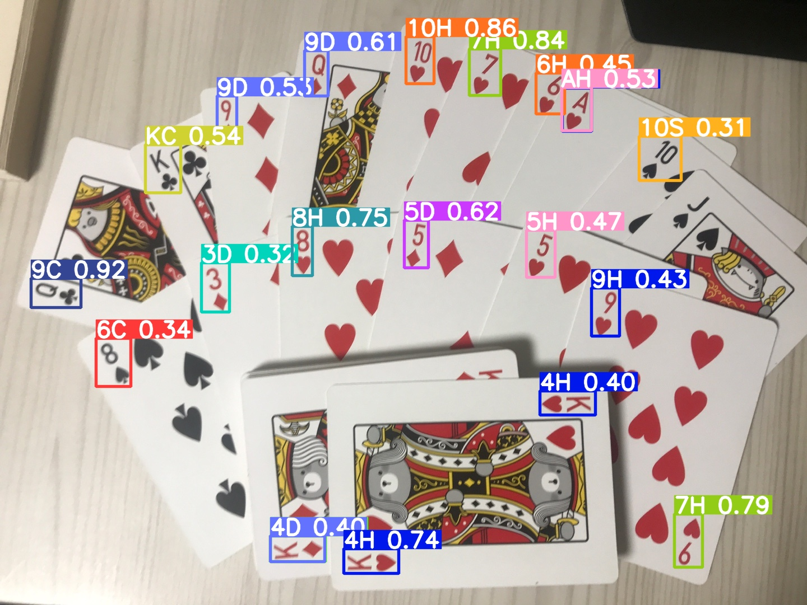
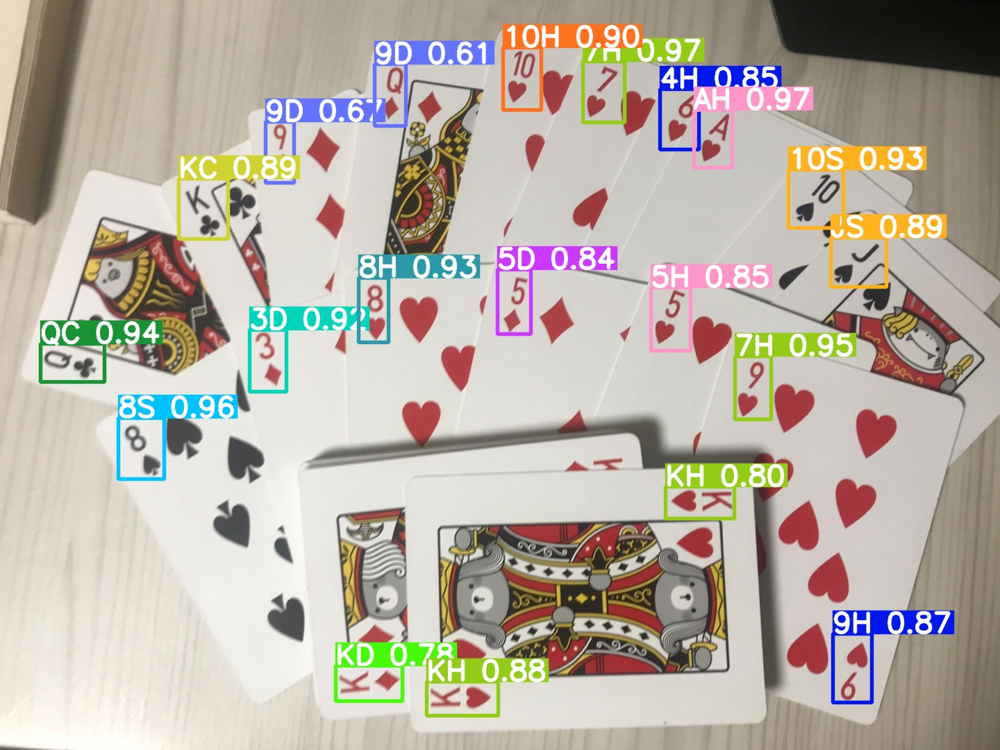
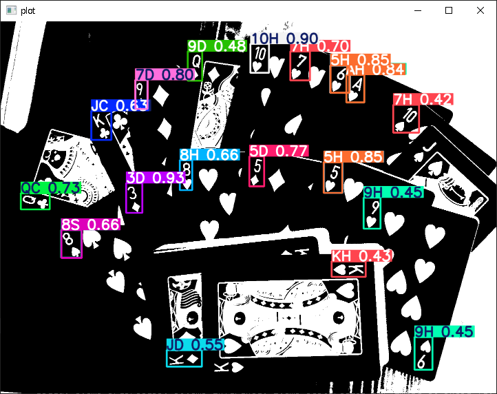
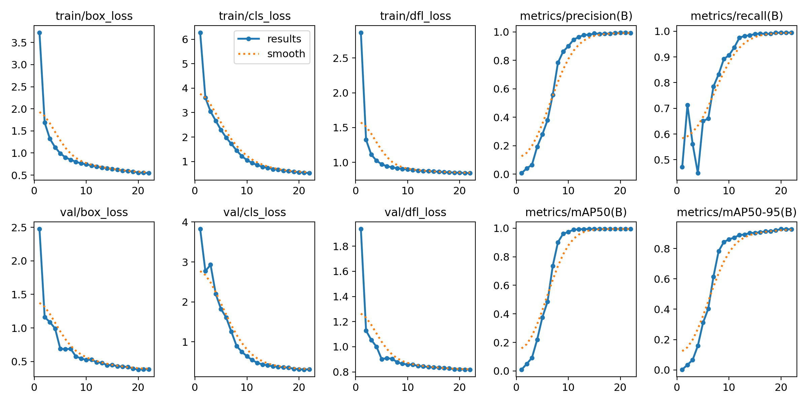
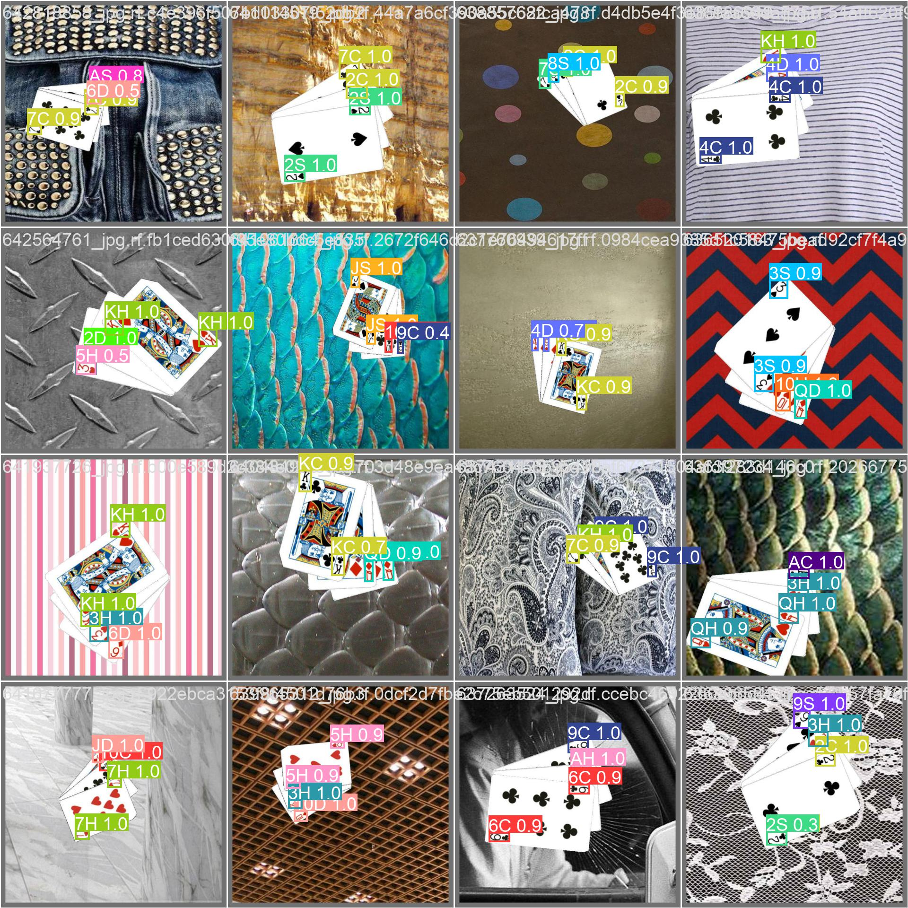

# try to improve

My effort, trial and errors to YOLOv8 model improving

## 1. 4_direction_predict.py

### Basic idea
YOLO is depending on angle of image.

For example, 9 and 6 should be distinguished while predict.

But, about playing card object detection, special logic should be applied.

Following two boxes should be detected as the same object, even though one is rotated 180 clockwise.

So I thought that merging 4 directions (0, 90, 180, 270 clockwise) predict results can improve performance better.

Merging is operated based on following factors: IOU of boxes, the number of boxes of a class, confidence.

And final result is generated after extracting the best boxes.

### Result

- Normal prediction

- 4 directional prediction

It has a little improvement.

## 2. binary_predict.py

### Basic idea
Preprocess(Threshold by opencv) the dataset and image, to make them binary images(black and white only).

### Result

It has little difference to RGB colored one's result. To make image binary seems meaningless.

## YOLOv8n training result

More information is in [runs/detect/train](runs/detect/train) directory.

## Trivia

I trained YOLO model by Google Colab Tesla T4 GPU. Its speed is very fast that it can train in 5 minutes per each epoch while my GTX 970 takes it in 3 hours.
- Google Colab: https://colab.research.google.com/drive/1V_ockD2_2i0JKbVKtafXlHP4El4PDOTR?usp=sharing
